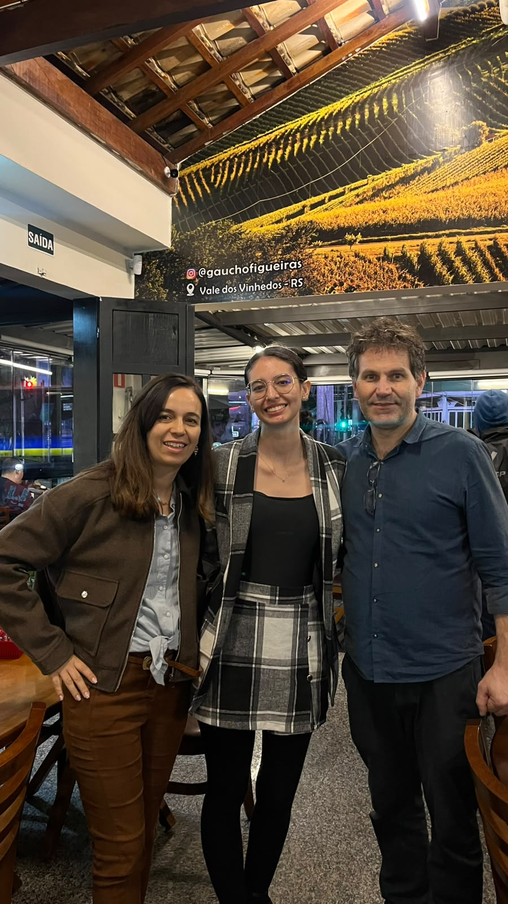

# Gaucho Churrascaria

Um trabalho universitário sobre um restaurante, para aprimorarmos nossas habilidades de HTML, visando a criação de um site para web. 

## Integrantes do projeto
**Nome:** Maria Eduarda Arakaki Rodrigues
**RGM:** 47484900 
**Github:** arakakirod-ship-it

**Nome:** Sabrina Hadassa Gomes de Andrade 
**RGM:** 47817593 
**Github:** sabrinahadassa

**Nome:** Thayna dos Santos Tavares da Silva
**RGM:** 47713551 
**Github:** thayna-tavares07

**Nome:** Vitória Lorena Freire Camargo 
**RGM:** 46874283
**Github:** vitoria-camargo1109

**Nome:** Yasmin 
**RGM:** 4 
**Github:** Miih08

## Funcionalidades

- **Página inicial** com botões para as demais páginas *(feita por Vitória)*
- **Carta de vinhos**  organizado por categorias, preços e descrições *(feita por Yasmin)*
- **Cardápio digital** organizado por categorias, preços e descrições *(feita por Yasmin)*
- **Delivery** para fazer o pedido online *(feita por Sabrina)*
- **Depoimentos de clientes** com avaliações reais *(feita por Thayna)*
- **Fale conosco** informações de contato *(feita por Vitória)*
- **Nossa unidade** com mapa incorporado e horário de funcionamento *(feita por Maria)*
- **Quem somos** descrição sobre o restaurante *(feita por Maria)*
- **Sistema de reservas** via formulário *(feita por Sabrina)*
- **Trabalhe conosco** informações de contato *(feita por Thayna)*

## Tecnologias

- HTML

## Link do website hospedado

- https://vitoria-camargo1109.github.io/projeto_GauchoChurrascaria/

## Indicação da validação no W3C.

Em andamento.

## Introdução apresentando a organização escolhida.

Realizamos o desenvolvimento de um site para um restaurante, com o foco na reformulação do site original. Para a organização optamos que a aluna Vitória Lorena Freire Camargo na responsibilidade de padronização e index das páginas, para terem o mesmo cabeçalho e rodapé, a mesma também programou a "página inicial" e o "fale conosco." Já para as páginas "cardápido digital" e "carta de vinhos" ficou na supervisão da aluna Yasmin, que realizou a mudança do cardápio antigo, que era em PDF, em texto, com um desing melhorado. Por sua vez, a aluna Sabrina Hadassa Gomes de Andrade ficou atarefada das páginas "delivery" e "reservas" alterando o estilo e guiando melhor os usuários. Além disso, a aluna Thayna dos Santos Tavares da Silva realizou a programação das páginas "depoimentos" e "trabalhe conosco" que foram adições ao site do cliente, possibilitando que interessados no estabelecimento tenham acesso à essas informações mais fácil. Por fim, a Aluna Maria Eduarda Arakaki Rodrigues ficou denominada de programar as páginas "nossa unidade" e "quem somos" deixando estas páginas com informações adicionais para melhor exibição do comércio.

## Relato e comprovação do contato

A aluna Maria Eduarda Arakaki Rodrigues realizou o contato com o responsável e sua esposa, ambos donos do negócio, para pedir a autorização. O encontro ocorreu de maneira positiva, com o cliente muito interessado na proposta, autorizando o uso das imagens e do nome do estabelecimento, pediu que fosse inspirado no site que ele já possuia, oferecemos páginas adicionais como os depoimentos, fale conosco, nossa unidade e trabalhe conosco. O cliente demonstrou agrado ao falarmos das adições, desde então entramos em contato para batermos informações e dar atualizações sobre o progresso.

## Conclusão com a reflexão do grupo sobre os aprendizados da etapa

Em andamento.